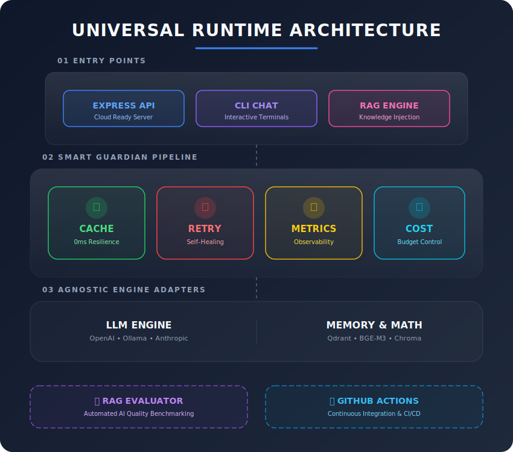

# 🤖 AI Universal Runtime

> **The "Universal Remote" for Artificial Intelligence—now with built-in Safety Guardians.**

[](https://www.typescriptlang.org/)
[](https://opensource.org/licenses/MIT)

Imagine you bought a high-end TV, but you could only ever use one specific remote that came with it. If you wanted to change brands, you'd have to rebuild your whole living room. 

**AI Universal Runtime** fixes that. It is a "translation layer" that allows you to write your code once and switch between different AI models (like ChatGPT, Anthropic, or local models like Ollama) or databases (like Qdrant) just by flipping a switch.

---

### 1. 🏗️ The "Guardians" Architecture (New!)

To make our AI runtime production-ready, we've added a **"Smart Pipeline."** Every request you send to an AI doesn't just go straight to the provider; it passes through three **Guardians** that protect your application:



1.  🛡️ **The Retry Guardian**: AI APIs can be "glitchy" (busy, slow, or temporary errors). This guardian automatically catches those glitches and retries the request instantly so your users never see an error message.
2.  📊 **The Metrics Guardian**: Ever wonder why an AI is feeling slow? This guardian tracks exactly how many milliseconds every part of the process takes, giving you a "speedometer" for your AI.
3.  💰 **The Cost Guardian**: AI isn't free. This guardian estimates the cost of every single question you ask **before** you get the bill, helping you stay within budget.
4.  💾 **The Intelligent Cache**: Remembers previous answers to identical questions. Saves **100% of the cost** and returns the answer in **0ms** the second time.

---

## 🏗️ Production Excellence (New!)

We've upgraded this runtime to be a deployable product:

- 🧪 **RAG Evaluator**: A built-in "AI Judge" that rates its own answers for accuracy and faithfulness to the data.
- 🌐 **API Server**: A standard REST API (Express) that allows your AI brain to be connected to any website or mobile app.
- 🤖 **DevOps Ready**: Automated GitHub Actions that test and build your code every time you save.

---

## 🌟 Why This Matters

- 🔓 **No More Lock-in**: Swap your AI brain (Model) or your AI memory (Database) in seconds without changing a single line of application code.
- 💰 **Save Money**: Use lightweight, free local models while building, then switch to powerful models (GPT-4) for launch.
- 🧠 **Smarter Memory**: Includes a **Semantic Chunker** that "reads" your data like a human, ensuring the AI only remembers the most relevant parts when answering questions.
- 🛡️ **Senior-Level Quality**: Built using the same patterns used by top-tier engineering firms (Piped Middleware & Factory Patterns).

---

## 📂 Deep Dive: Project Architecture

The project is structured as a **Monorepo** to keep the core logic strictly separated from the specific "connectors" (Adapters) and the final apps.

### 1. `packages/core` (The Brain)
This is the heart of the runtime. It defines the "Contracts" (Interfaces) that every AI service must follow.
- **Factories**: These are the "Dispatchers." When you ask for an LLM, the `LLMFactory` looks at your config and grabs the right adapter.
- **Middleware Pipeline**: This is where the **Guardians** live. We use a "Pipe" pattern, meaning every request is automatically wrapped in safety layers (Retries -> Metrics -> Cost).
- **Config**: A single, type-safe Zod schema that validates your entire AI stack at startup.

### 2. `packages/adapters` (The Connectors)
These are the "Plugs" for different services.
- **LLM Adapters**: Specific code to talk to OpenAI, Ollama, Anthropic, etc.
- **Vector Adapters**: Specific code to talk to Qdrant, Pinecone, or local memory.
- **Embedding Adapters**: Code to translate human text into "AI vectors" using various models.

### 3. `apps/` (The Frontline)
Practical demonstrations of the runtime in action.
- **`chat`**: A simple, fast chat implementation using base AI knowledge.
- **`rag-chat`**: A full "Talk to your data" implementation showing how search, memory, and chat work together.
- **`dashboard`**: A CLI tool to visualize what's happening inside your AI database.

---

## 🔄 The Data Flow (RAG Journey)

1. **Ingest**: Text is cleaned by the **Semantic Chunker** -> Converted to Vectors by the **Embedding Adapter** -> Stored in **Qdrant**.
2. **Query**: User asks a question -> Question is vectorized -> **Vector Adapter** finds matching data -> **LLM Adapter** generates an answer using that data.
3. **Protect**: Every single step is logged by **Metrics** and protected by **Retries**.

---

## 🎭 Framework Personalities

This runtime isn't just a "bridge" for models; it supports different **AI Framework Philosophies**. You can see this in action by toggling the `framework` setting in your config:

- **⚡ Mastra Runtime (`mastra`)**: Designed for **High Speed**. It uses a direct execution engine with minimal overhead, perfect for real-time agents and edge computing.
- **🦜 LangChain Runtime (`langchain`)**: Designed for **Structured Chains**. It follows the industry-standard "procedural" approach, wrapping requests in multi-step "Prompt Templates" and "Chain Sequences" for complex multi-turn logic.

---

## ⚙️ The "Switch" (Config-Driven)

The entire behavior of your AI stack is controlled by `packages/core/config/ai.config.ts`. 

```typescript
// To switch your entire app from Local to OpenAI:
export const aiConfig = {
  llm: { 
    provider: "openai", // Just change this
    model: "gpt-4o" 
  },
  // Everything else updates automatically!
};
```

---

---

## 🚦 The Two Execution Flows

This repository demonstrates the two fundamental ways to build AI applications:

### 1️⃣ Simple Chat (Base AI)
- **Folder**: `apps/chat/`
- **Concept**: Uses the AI's "General Knowledge" (what it was trained on). It’s fast and covers a wide range of topics, but doesn't know about your private data.
- **Run it**: `npm run demo "Who is the President?"`

### 2️⃣ Professional RAG (Knowledge Injection)
- **Folder**: `apps/rag-chat/`
- **Concept**: The "Senior Engineer" approach. It first cleans your documents (**Semantic Chunker**), remembers them (**Vector Storage**), and then answers questions based **strictly on your data**.
- **Run it**: `npm run rag:demo`

---

## 🚀 Quick Start (Try It Live)

### 1. Setup
```bash
npm install
docker-compose up -d  # Spins up your local Qdrant Vector DB & Ollama automatically!
```

### 2. Run the Demos
- **The RAG Masterclass (Professional Flow)**:
  ```bash
  npm run rag:demo
  ```

- **RAG Evaluation**: Test how accurate your AI is.
  ```bash
  npm run eval
  ```

- **API Server**: Start the cloud-ready server (Base Chat + RAG).
  ```bash
  npm run server
  ```
  - `POST http://localhost:3000/api/chat` (Simple)
  - `POST http://localhost:3000/api/rag` (Smart Integration)

- **Simple AI Chat**:
  ```bash
  npm run demo "What are the benefits of this universal runtime?"
  ```

- **Data Dashboard**: See what's currently stored in your AI's "Memory."
  ```bash
  npm run dashboard
  ```

---

## 📄 License
Project is licensed under the MIT License. Built for developers who want to stay fast and stay free.